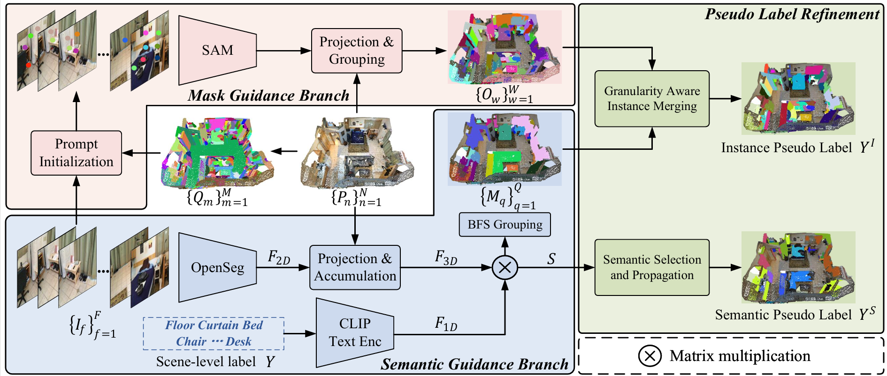

# DBGroup

## [AAAI2026] DBGroup: Dual-Branch Point Grouping for Weakly Supervised 3D Semantic Instance Segmentation

[[Arkiv]](https://arxiv.org/abs/2511.10003)



## Environments

### Creat Conda Environment

```
conda create -n dbg python=3.8
conda activate dbg
```

### Install Package

```
pip install torch==1.13.0+cu116 torchvision==0.14.0+cu116 torchaudio==0.13.0 --extra-index-url https://download.pytorch.org/whl/cu116
pip install tensorflow==2.11.0
pip install -r requirements.txt
```

### Install [PointGroup](https://github.com/dvlab-research/PointGroup)

```
cd lib/pointgroup_ops
python setup.py develop
cd ../../
```

### Install Segmentator

```
cd lib/segmentator
cd csrc && mkdir build && cd build
conda install cmake cudnn

cmake .. \
-DCMAKE_PREFIX_PATH=`python -c 'import torch;print(torch.utils.cmake_prefix_path)'` \
-DPYTHON_INCLUDE_DIR=$(python -c "from distutils.sysconfig import get_python_inc; print(get_python_inc())")  \
-DPYTHON_LIBRARY=$(python -c "import distutils.sysconfig as sysconfig; print(sysconfig.get_config_var('LIBDIR'))") \
-DCMAKE_INSTALL_PREFIX=`python -c 'from distutils.sysconfig import get_python_lib; print(get_python_lib())'`

make && make install # after install, please do not delete this folder (as we only create a symbolic link)
```

Further segmentator information can be found in [DKNet](https://github.com/W1zheng/DKNet) and [Segmentator](https://github.com/Karbo123/segmentator).

### Download Checkpoint

Download the **[ViT-H SAM model](https://dl.fbaipublicfiles.com/segment_anything/sam_vit_h_4b8939.pth)** and **[OpenSeg model](https://drive.google.com/file/d/1DgyH-1124Mo8p6IUJ-ikAiwVZDDfteak/view?usp=sharing)** and put them into the `checkpoint` folder.

## Dataset Preparation

Follow the [scripts/feature_fusion/README.md](scripts/feature_fusion/README.md) to prepare the data.

Download the [gt file](https://drive.google.com/file/d/1VwDtNTCzPEbQaK7xmG6KXzHvAicKDIc_/view?usp=sharing) and unzip it into `data` folder.

## Pesudo Label Generation

(1) SGB

Follow the [scripts/feature_fusion/README.md](scripts/feature_fusion/README.md) to get the logit.

```
python bfsgrouping.py
```

(2) MGB

```
python MGB.py
```

(3) GAIM

```
python GAIM.py
```

(4) SSP

```
python SSP.py
```

## Citation

If you find this work useful in your research, please cite:

```
@misc{liu2025dbgroupdualbranchpointgrouping,
      title={DBGroup: Dual-Branch Point Grouping for Weakly Supervised 3D Instance Segmentation}, 
      author={Xuexun Liu and Xiaoxu Xu and Qiudan Zhang and Lin Ma and Xu Wang},
      year={2025},
      eprint={2511.10003},
      archivePrefix={arXiv},
      primaryClass={cs.CV},
      url={https://arxiv.org/abs/2511.10003}, 
}
```

## Acknowlegement

This project is not possible without multiple great opensourced codebases. We list some notable examples:
[PointGroup](https://github.com/dvlab-research/PointGroup), [PBNet](https://github.com/weiguangzhao/PBNet), [Openscene](https://github.com/pengsongyou/openscene),[SAMPro3D](https://github.com/GAP-LAB-CUHK-SZ/SAMPro3D), [SAM3D](https://github.com/Pointcept/SegmentAnything3D), [3DSSVLG](https://github.com/xuxiaoxxxx/3DSS-VLG) etc.
